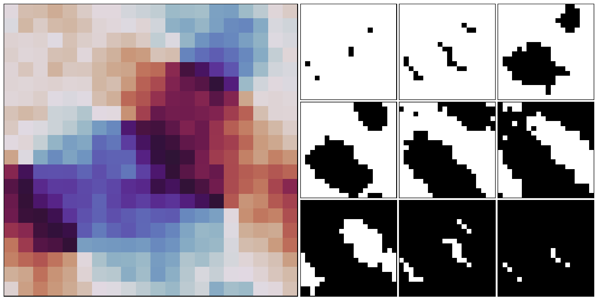

## Persistent Homology for Phase Transitions

Persistent homology is used on Monte-Carlo simulation of lattice spin models. Phase transitions, order parameters and critical exponents are extracted from persistence images for two-dimensional models. Straighforward interpretability allows for features such as magnetization, frustration and vortex-antivortex structure to be easily identified.

See the following for more details:

>*Quantitative and Interpretable Order Parameters for Phase Transitions with Persistent Homology* [[2009.xxxxx](https://arxiv.org/abs/2009.xxxxx)]
>
>Authors: Alex Cole, Gregory J. Loges and Gary Shiu
